# sprite-extend-shapes

[Test-Online](https://spritejs.github.io/sprite-extend-shapes/docs/website/)

## 项目说明

`sprite-extend-shapes` 是基于`SpriteJS`的常用几何图形扩展库。当前支持的图形：

- [Shape](#shape)
  - [Polyline](#polyline-折线)
  - [Arc](#arc-弧线)
  - [Polycurve](#polycurve-多重曲线)
  - [Polygon](#polygon-多边形)
    - [Triangle](#triangle-三角形)
    - [Rect](#rect-正方形)
    - [Star](#star-星形)
  - [EllipseSector](#ellipsesector-椭圆扇形)
    - [Ellipse](#ellipse-椭圆形)
      - [EllipseArc](#ellipsearc-椭圆弧)
      - [Circle](#circle-圆)
    - [Sector](#sector-圆扇形)
  - [Ring](#ring-圆环)

## Shape

`Shape` 类继承自 `sprite-core` 的 `BaseSprite`，是该图形扩展库所有图形的基类。

### Polyline 折线

`Ployline` 用于绘制线条。

|   属性    |         说明         |       默认值       |
| :-------: | :------------------: | :----------------: |
|  points   |   各个连接点的坐标   |       `null`       |
|   color   | 连接点之间连线的颜色 | `rgba(0, 0, 0, 1)` |
| lineWidth |       线条宽度       |         1          |
|  lineCap  |   线条末端绘制样式   |      `round`       |
| lineJoin  |   两线条交汇处样式   |      `round`       |

示例：

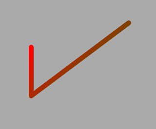

```javascript
const polyline = new Polyline();
polyline.attr({
  color: {
    vector: [0, 0, 150, 150],
    colors: [{offset: 0, color: 'red'}, {offset: 1, color: 'green'}]
  },
  lineWidth: 10,
  points: [[0, 0], [0, 100], [200, -50]],
  bgcolor: '#eee'
});
```

### Arc 弧线

`Arc` 用于绘制弧线。

|     属性      |              说明              |  默认值  |
| :-----------: | :----------------------------: | :------: |
|    center     |        绘制弧线的中心点        |  `null`  |
|  startPoint   |         弧线绘制的起点         | `[0, 0]` |
|     angle     |       绘制弧线转过的角度       |   `0`    |
|     color     |           弧线的颜色           |  `#000`  |
|   lineWidth   |            弧线宽度            |   `1`    |
| anticlockwise | 当该值为`true`时，将逆时针绘制 | `false`  |

示例：

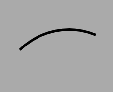

```javascript
const arc = new Arc();
arc.attr({
  center: [100, 100],
  startPoint: [0, 0],
  angle: (Math.PI / 2) * 0.75,
  lineWidth: 5
});
```

### Polycurve 多重曲线

`Polycurve` 用于绘制多重曲线，其底层使用的是 `canvas.bezierCurveTo(cp1x, cp1y, cp2x, cp2y, x, y)` API（因此也可以理解为“绘制多个贝塞尔曲线”）。

|    属性    |                             说明                             |  默认值  |
| :--------: | :----------------------------------------------------------: | :------: |
|   points   | 绘制贝塞尔曲线的数组（**注意数组的每一子数组长度应为 `6`**） |   `[]`   |
| startPoint |                           绘制起点                           | `[0, 0]` |
| lineWidth  |                           曲线宽度                           |    1     |
|  lineCap   |                       曲线末端绘制样式                       | `round`  |
|  lineJoin  |                       两曲线交汇处样式                       | `round`  |

示例：

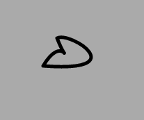

```javascript
const polycurve = new Polycurve();
polycurve.attr({
  points: [[20, -10, 110, 50, -20, 40], [10, -10, 20, 50, 0, 0]],
  lineWidth: 5
});
```

### Polygon 多边形

`Polygon` 用于绘制多边形。

|   属性    |      说明      |       默认值       |
| :-------: | :------------: | :----------------: |
|  points   |  各顶点的坐标  |       `null`       |
|   color   |    边的颜色    | `rgba(0, 0, 0, 1)` |
| fillColor | 多边形填充颜色 | `rgba(0, 0, 0, 1)` |
| lineWidth |    线条宽度    |         1          |
|  lineCap  | 边末端绘制样式 |      `round`       |
| lineJoin  | 两边交汇处样式 |      `round`       |

示例：

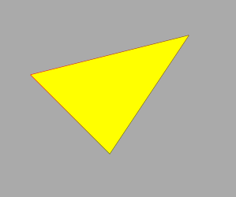

```javascript
const polygon = new Polygon();
polygon.attr({
  color: {
    vector: [0, 0, 150, 150],
    colors: [{offset: 0, color: 'red'}, {offset: 1, color: 'green'}]
  },
  fillColor: 'yellow',
  points: [[0, 0], [100, 100], [200, -50]]
});
```

#### Triangle 三角形

`Triangle` 继承自 `Polygon`，用于绘制三角形，其大部分属性与 `Polygon` 一致。在 `Polygon` 的基础上，`Triangle` 需要设置“两边的长度”和“两边的夹角”即可完成绘制。

| 属性  |   说明   |   默认值   |
| :---: | :------: | :--------: |
| sides | 两边边长 | `[10, 10]` |
| angle | 两边夹角 |    `60`    |

示例：

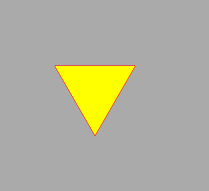

```javascript
const triangle = new Triangle();
triangle.attr({
  color: 'red',
  sides: [80, 80],
  angle: '60',
  fillColor: 'yellow'
});
```

#### Rect 正方形

`Rect` 继承自 `Polygon`，用于绘制矩阵。在 `Polygon` 的基础上，`Rect` 需要额外设置“两边的长度”，如果想要绘制平行四边形，可以改变`angle`属性的数值即可。

| 属性  |   说明   |   默认值   |
| :---: | :------: | :--------: |
| sides | 两边边长 | `[10, 10]` |
| angle | 两边夹角 |    `90`    |

示例：

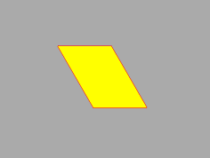

```javascript
const rect = new Rect();
rect.attr({
  color: 'red',
  sides: [60, 80],
  angle: 60,
  fillColor: 'yellow'
});
```

#### Star 星形

`Star` 继承自 `Polygon` 用于绘制规则的多角形。`Star` 将多角形的绘制分为`内接圆`和`外接圆`之上点的连接，默认`内接圆`的半径为`0.4 * 外接圆的半径`，也可手动设置。

|    属性     |    说明    |     默认值     |
| :---------: | :--------: | :------------: |
|   radius    | 外接圆半径 |      `0`       |
| innerRadius | 内切圆半径 | `0.4 * radius` |
|    angle    |  角的数量  |      `5`       |

示例：

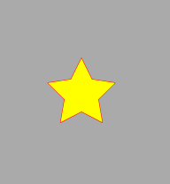

```javascript
const star = new Star();
star.attr({
  radius: 40,
  innerRadius: 30,
  color: 'red',
  angles: 5,
  fillColor: 'yellow'
});
```

### EllipseSector 椭圆扇形

`EllipseSector` 继承自 `Shape`，用于绘制椭圆扇形。

|    属性    |       说明       |       默认值       |
| :--------: | :--------------: | :----------------: |
|  radiusX   |      短半径      |        `10`        |
|  radiusY   |      长半径      |        `20`        |
| startAngle |     起始角度     |        `0`         |
|  endAngle  |     终止角度     |       `360`        |
|   color    |   描边线条颜色   | `rgba(0, 0, 0, 1)` |
| fillColor  |     填充颜色     | `rgba(0, 0, 0, 1)` |
| lineWidth  |     线条宽度     |         1          |
|  lineCap   | 线条末端绘制样式 |      `round`       |
|  lineJoin  | 两线条交汇处样式 |      `round`       |

示例：

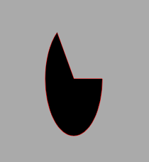

```javascript
const ellipseSector = new EllipseSector();
ellipseSector.attr({
  radiusX: 30,
  radiusY: 80,
  startAngle: 0,
  endAngle: Math.PI * 1.3,
  lineWidth: 1,
  color: 'red'
});
```

#### Ellipse 椭圆形

`Ellipse` 继承自 `EllipseSector`，用于绘制椭圆。 与`EllipseSector`相比， `Ellipse` 不需指定`startAngle`和`endAngle`。

示例：

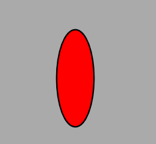

```javascript
const ellipse = new Ellipse();
ellipse.attr({
  radiusX: 30,
  radiusY: 80,
  fillColor: 'red',
  lineWidth: 5
});
```

##### EllipseArc 椭圆弧

`EllipseArc` 继承自 `Ellipse`，用于绘制椭圆弧线（与 `Arc` 的区别）。
`EllipseArc` 放开了 `startAngle` 和 `endAngle` 的限制。

示例：

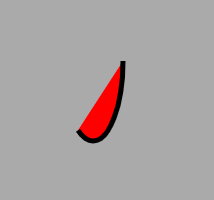

```javascript
const ellipseArc = new EllipseArc();
ellipseArc.attr({
  radiusX: 30,
  endAngle: 120,
  radiusY: 80,
  fillColor: 'red',
  lineWidth: 5
});
```

##### Circle 圆

`Circle` 继承自 `Ellipse`。与`Ellipse`相比， `Circle` 只需指定一个半径，即`radius`，而无需指定`radiusX`和`radiusY`。

|  属性  | 说明 | 默认值 |
| :----: | :--: | :----: |
| radius | 半径 |  `10`  |

示例：

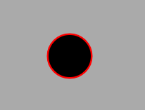

```javascript
const circle = new Circle();
circle.attr({
  radius: 30,
  lineWidth: 5,
  color: 'red'
});
```

#### Sector 圆扇形

`Sector` 继承自 `EllipseSector`，用于绘制圆扇形。与`EllipseSector`相比， `Sector` 只需指定一个半径，即`radius`，而无需指定`radiusX`和`radiusY`。

|  属性  | 说明 | 默认值 |
| :----: | :--: | :----: |
| radius | 半径 |  `10`  |

示例：

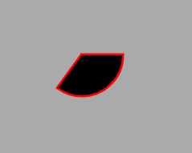

```javascript
const sector = new Sector();
sector.attr({
  startAngle: 0,
  endAngle: Math.PI * 0.7,
  radius: 50,
  lineWidth: 5,
  color: 'red'
});
```

### Ring 圆环

`Ring` 继承自 `Shape`，用于绘制圆环。

|    属性     |     说明     |       默认值       |
| :---------: | :----------: | :----------------: |
| innerRadius |   内圆半径   |        `10`        |
| outerRadius |   外圆半径   |        `20`        |
| startAngle  |   起始角度   |        `0`         |
|  endAngle   |   终止角度   |       `360`        |
|    color    | 描边线条颜色 | `rgba(0, 0, 0, 1)` |
|  fillColor  |   填充颜色   | `rgba(0, 0, 0, 1)` |
|  lineWidth  |   线条宽度   |         1          |

示例：

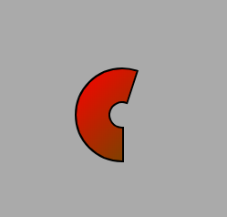

```javascript
ring.attr({
  innerRadius: 15,
  outerRadius: 50,
  fillColor: {
    vector: [0, 0, 150, 150],
    colors: [{offset: 0, color: 'red'}, {offset: 1, color: 'green'}]
  },
  lineWidth: 4,
  startAngle: Math.PI * 0.5,
  endAngle: Math.PI * 1.6
});
```
